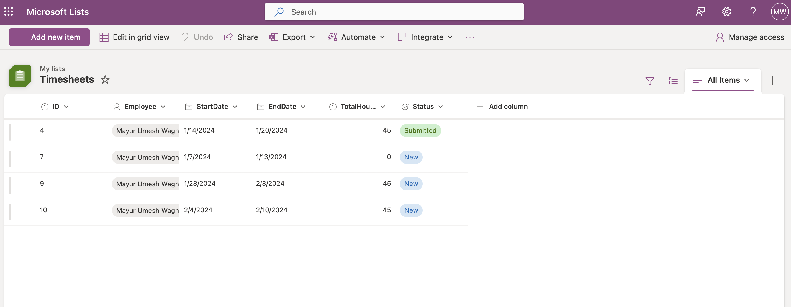

# Timesheet-Application---Canvas-PowerApps

# The Timesheets App

Introduction

The Timesheets App is a Microsoft PowerApps solution designed to streamline the process of tracking and managing employees' worked hours within a company. It allows employees to input their weekly worked hours along with specific paycodes (such as regular, overtime, sick, etc.) through an intuitive interface. Once the timesheet is completed, employees can submit it to their respective managers for review and approval.
Tools Used

    Microsoft PowerApps
    SharePoint

Features

    Employee Timesheet Submission: Employees can easily enter their worked hours and associated paycodes into the app.

    
    Paycode Classification: The app supports various paycodes including regular hours, overtime, sick leave, and more, ensuring accurate tracking of different types of worked hours.

    
    Submitted timesheets cannot be deleted.
    

    Manager Review and Approval: Submitted timesheets are routed to managers for review and approval, streamlining the workflow process.

    Integration with SharePoint: Utilizes SharePoint for data storage and management, providing a robust and scalable solution.

Usage

    Employee Entry: Employees log in to the Timesheets App and enter their worked hours for the week, selecting appropriate paycodes for each entry.
    Submission: Once the timesheet is complete, employees submit it for manager review.
    Manager Review: Managers receive notifications about submitted timesheets and can review them within the app.
    Approval: Managers approve or reject timesheets based on accuracy and compliance with company policies.
    Reporting: Utilize the data stored in SharePoint for generating reports and insights into employee work hours and payroll.

Contributing

Contributions to the Timesheets App are welcome! If you have any ideas for improvements or would like to report issues, please open an issue or submit a pull request.